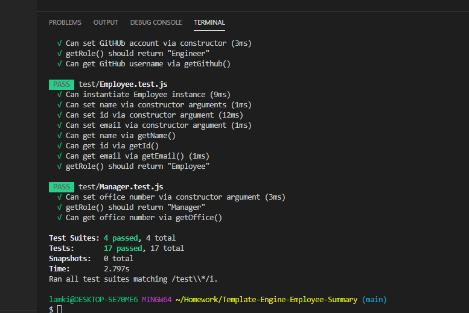

# Template Engine Employee Summary

## Overview
A node project that the user is prompted to answer a series of questions in order to generate a list of employees separated by roles.

## Installation
In order to run this program you need to install node by typing node install, in your terminal. 

## Screen shot of tests passing

## Link to Video of Working App
[Video](https://youtu.be/y8a-VLe5Ad4)

## Project Status
Current status is having some errors with writing to the html and therefore am unable to change the styling of the page. Still working on this repository.
